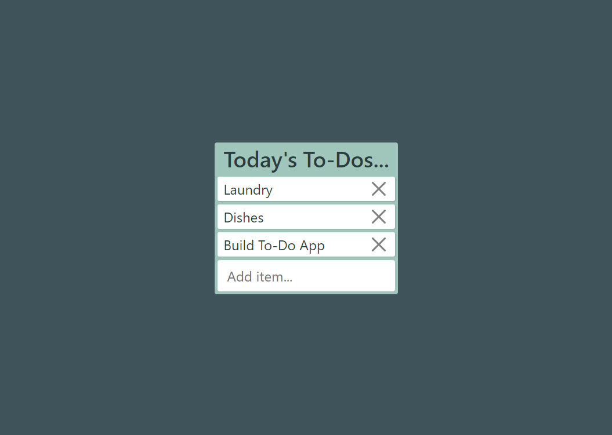

# To-Do List 

Week 13 assignment to finish a basic js To-Do list interface. 

## To run...

1. Download the files to your computer.

2. After navigating to the project's root folder and install http-server.
3. Enter the below commands via the terminal from within the project root folder:

        http-server -c-1

4. Follow the prompts to open the project in a browser window. 

## Features
* Add new item to the list via the "Add item" input field.
* Remove an item by clicking the X.